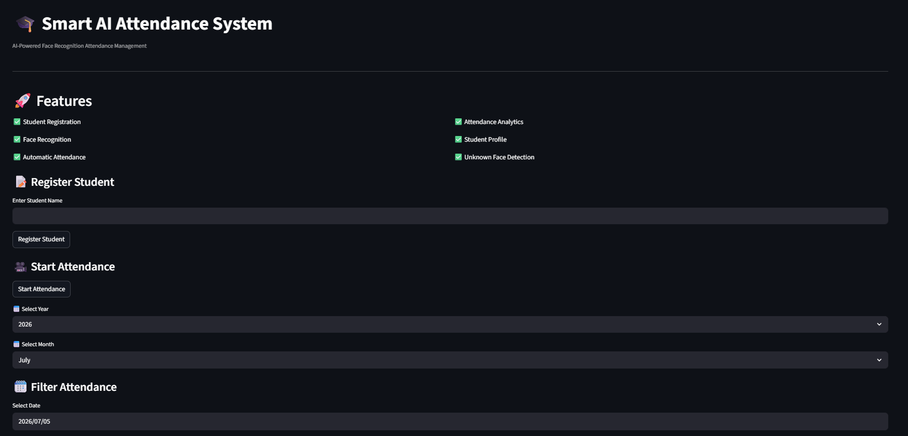
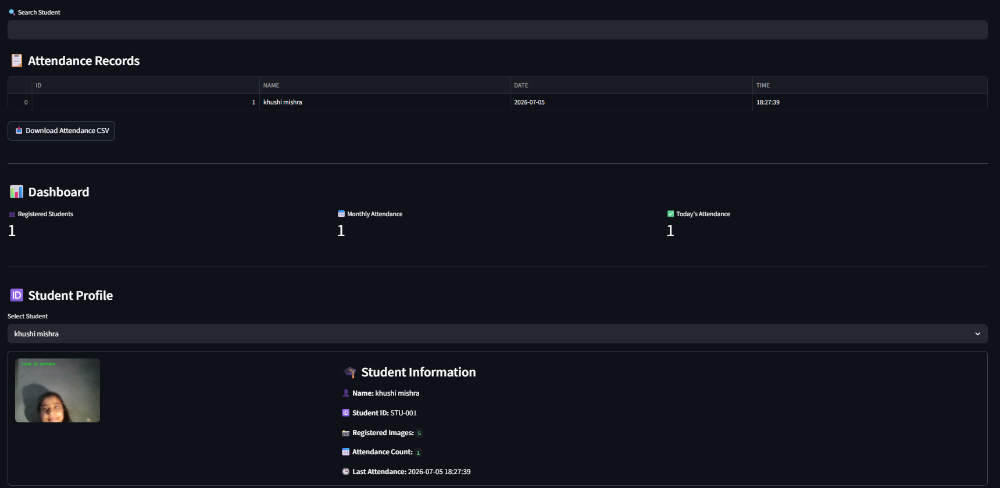
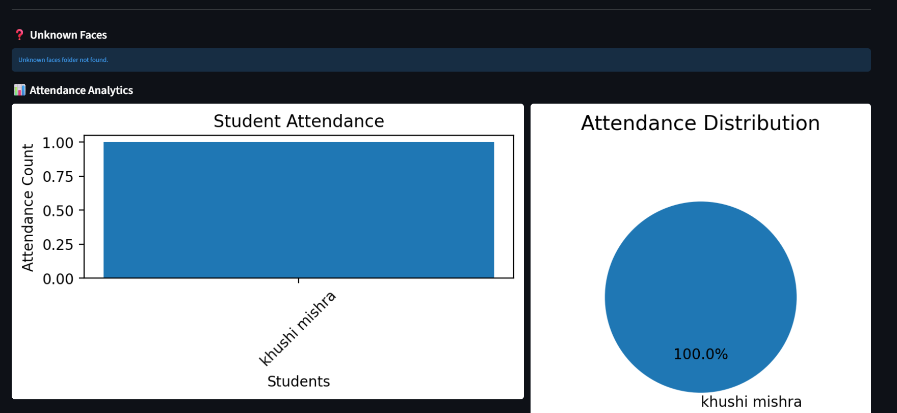

# 🎓 AI Smart Attendance System using Face Recognition

An AI-powered attendance management system that automatically recognizes registered students using face recognition and marks attendance in real time. Built with **Python, Streamlit, OpenCV, SQLite, and Face Recognition**, the system eliminates manual attendance, reduces proxy attendance, and provides an interactive dashboard for attendance management.


---

# ✨ Features

- 👤 Register new students with face images
- 📸 Automatic face encoding generation
- 🎯 Real-time face recognition
- ✅ Automatic attendance marking
- 📊 Interactive attendance dashboard
- 📅 Date-wise attendance filtering
- 🔍 Search attendance by student name
- 📈 Attendance analytics using bar charts
- 🥧 Attendance distribution using pie charts
- 🆔 Student profile card
- 📥 Download attendance records as CSV
- ❓ Unknown face detection and storage

---

# 🛠 Tech Stack

| Technology | Purpose |
|------------|---------|
| Python | Programming Language |
| Streamlit | Web Application |
| OpenCV | Image Processing |
| face_recognition | Face Detection & Recognition |
| SQLite | Attendance Database |
| Pandas | Data Handling |
| Matplotlib | Data Visualization |

---

# 📂 Project Structure

```text
attendance-system/
│
├── app.py
├── main.py
├── Database.py
├── Attendance.py
├── student.py
├── recognizer.py
├── save_encodings.py
├── student_registration.py
├── requirements.txt
├── README.md
├── photos/
└── unknown_faces/
```

---

# 📸 Screenshots

# 📸 Screenshots

| Home Page | Dashboard and Student Profile |
|-----------|-----------|
|  |  |

| Student Registration | Analytics |
|----------------------|-----------|
|  |  |


# ⚙ Installation

Clone the repository

```bash
git clone https://github.com/<your-username>/AI-Smart-Attendance-System.git
```

Go to the project folder

```bash
cd AI-Smart-Attendance-System
```

Install dependencies

```bash
pip install -r requirements.txt
```

Run the application

```bash
streamlit run app.py
```

---

# 🚀 How It Works

1. Register a student.
2. Capture multiple face images.
3. Generate face encodings automatically.
4. Start the attendance system.
5. The webcam recognizes registered students.
6. Attendance is recorded in SQLite.
7. View attendance records, analytics, and reports from the dashboard.

---

# 📊 Project Highlights

- Real-time face recognition
- Automatic attendance logging
- Duplicate attendance prevention
- Attendance analytics dashboard
- Student profile information
- CSV export support
- Unknown face detection

---

# 🔮 Future Enhancements

- Email attendance reports
- Monthly attendance reports
- Admin authentication
- Cloud database integration
- Live webcam inside Streamlit

---

# 👩‍💻 Author

**Khushi Mishra**

Diploma Student in Artificial Intelligence & Machine Learning

If you found this project useful, consider giving it a ⭐ on GitHub.